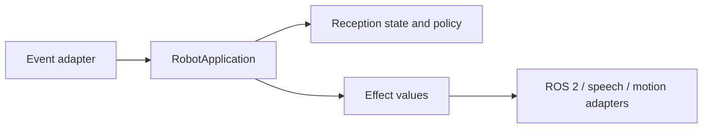

# Architecture

`RobotApplication` owns the business state: per-person presence, pending absence, farewell deduplication, interaction suppression, and the last accepted timestamp. `models.py` only defines immutable transport values. Integration adapters translate external events into `Event` and returned `Effect` values into real robot commands; the policy never imports ROS 2, cameras, or hardware SDKs.

The per-person record owns reception-cycle state. Application-level flags own conversation and meeting suppression. `TICK` is the only operation that confirms a timeout, making farewell deterministic and repeatable.

Future VIP support should be a policy/rules service selected by person metadata, RAG should be an optional response/content service called by an effect translator, and ROS 2 navigation should be another adapter. These extensions keep I/O at the boundary and avoid turning `RobotApplication` into a hardware-aware god class.
